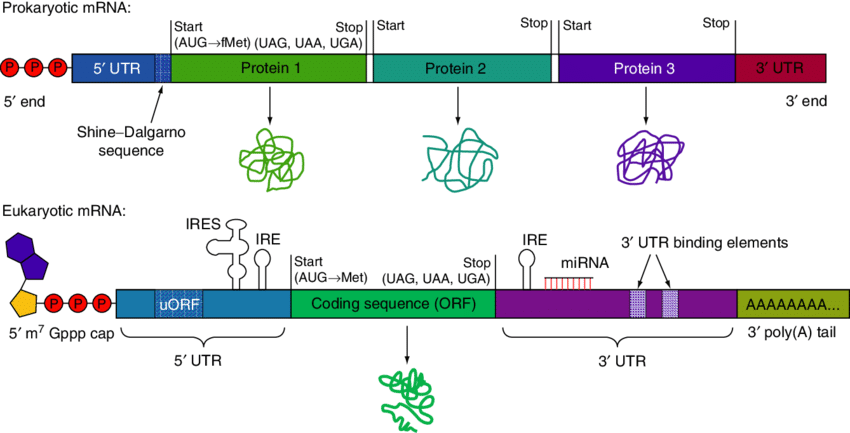

# Applied NGS

## Week 1 Learning Outcomes

- explain RNA processing (e.g. transcription, splicing) and how it motivates specialised tools for data analysis.
- analyse (normalise, transform and visualise) RNA-Seq data.
- compare different RNA-Seq datasets and identify differentially expressed genes in a statistically rigorous way.
- interpret their findings using online databases (in particular individual genes using GeneCards).

## Transcription and mRNA

Exons/introns (eukaryotes), splicing, alternative splicing and isoforms, mRNA, structure of mRNA (not all translated
into proteins)

Source: [Messenger RNA (mRNA): The Link between DNA and Protein](https://www.researchgate.net/publication/301856081_Messenger_RNA_mRNA_The_Link_between_DNA_and_Protein)

In the image:

- **PPP**: *5' Triphosphate Cap* – Protects mRNA from degradation and is important for ribosome recognition during
  translation.
- **uORF**: *Upstream Open Reading Frame* – A small coding region before the main ORF that can regulate translation
  efficiency.
- **ORF**: *Open Reading Frame* – The coding region of mRNA that is translated into protein.
- **3' UTR binding elements**: *3' Untranslated Region Binding Elements* – Sequences in the 3' UTR that regulate mRNA
  stability, localization, and translation.
- **CDS**: *Coding Sequence*  – The portion of mRNA that is translated into a protein, starting with a start codon and
  ending with a stop codon (not in the picture).

You can find the known isoforms of a gene on Ensembl, e.g.
see [here](https://www.ensembl.org/Homo_sapiens/Gene/Summary?db=core;g=ENSG00000167460;r=19:16067021-16103002).

Reference for RNA-seq, [RNA Sequencing and Analysis](https://cshprotocols.cshlp.org/content/2015/11/pdb.top084970.long).

### What are the advantages of RNA sequencing technology over older technologies?

- RNA sequencing (RNA-seq) provides **high resolution**, detecting even rare transcripts and **novel transcripts** not
  present in predefined gene sets (unlike microarrays).
- It allows for **quantitative measurement** of gene expression across the entire transcriptome and offers **better
  dynamic range** for low- and high-abundance transcripts.
- RNA-seq also detects **alternative splicing, fusion genes, post-transcriptional modifications**, and **non-coding RNA
  ** species.

### What are the different types of library preparation and for which use case are they employed?

- **Poly(A) selection**: Enriches mRNA by selecting polyadenylated transcripts, typically used for studying coding RNA
  in eukaryotes; optimal for mRNA.
- **Ribosomal RNA (rRNA) depletion (aka ribodepletion)**: Removes abundant rRNA, useful for detecting both coding and
  non-coding RNA in prokaryotic and eukaryotic samples, and not yet completely spliced transcripts.
- **Strand-specific libraries**: Preserves the directionality of RNA transcripts, helping in the study of overlapping
  genes and antisense transcripts.
- **Total RNA sequencing**: Captures all RNA, including non-coding, to study the whole transcriptome.

### Is the quality of the isolated RNA important?

High-quality RNA is crucial for reliable sequencing data, as degraded or low-quality RNA can lead to biased or
incomplete results, reducing the accuracy of transcript detection and quantification.

Missing quizzes here
https://canvas.bham.ac.uk/courses/74996/pages/check-your-understanding-measuring-rna-levels-by-sequencing?module_item_id=3696338

## Basic Steps in RNA-seq

- **Quality control** after receiving the reads, e.g. with FastQC; note that with RNA-seq you might have biased k-mer
  content. Check if trimming is required, also if there is an excess of polyA tails.
- **Sequence trimming** reads with low quality at the ends can be trimmed, as well as adaptor sequences and polyA tails
  should be removed.
- **Alignment** the reads can be aligned against a reference genome or a genome assembled de-novo. In case of isoforms (
  most but not all the eukaryotes) a splice-aware alignment can be used against a reference, or alignment can be done
  against all the known transcripts.
- **QC after alignment** check the coverage of intergenic, intronic and exonic regions, and ribosomal RNA (ribosomal
  genes). Note that intergenic regions can produce non-coding RNAs (ncRNA). Check the mapping rate (percentage of
  aligned reads) and the uniquely mapped reads.
- **Normalization** to contrast batch effects
- **Quantification**

## What are examples of splice-aware aligners?

- STAR
- Hisat2
- TopHat2
- BBMap
- GMAP/GSNAP

## What are examples of classification based aligners?

- kallisto
- salmon

### Why are genes with low read counts filtered out?

For several reasons:

- **Improved P-value Corrections**: p-value corrections for multiple testing depend on the overall number of tests; with
  fewer genes there are fewer tests, and therefore a smaller correction on p-values, and consequently more power (fewer
  false negatives).
- **Statistical Noise**: Genes with very low counts are more susceptible to random fluctuations and technical noise,
  making it harder to accurately estimate their expression levels.
- **Low Power for Differential Expression Detection**: For genes with low counts, there is often insufficient data to
  detect significant changes in expression between conditions. Filtering these genes improves the overall power of the
  analysis.
- **Computational Efficiency**: Filtering reduces the number of tests that need to be performed, improving computational
  speed and memory usage.

## Units for Normalized Expression Levels

### RPKM

Reads Per Kilobase of transcript per Million mapped reads. Used for single-end reads, it normalises for sequencing depth
and feature length. Meant to compare features within a given sample.

For a given feature:

$$RPKM= 10^9\frac{\mbox{No. of reads mapped to feature}}{\mbox{Feature length} \cdot \mbox{Total no. of mapped reads}}$$

$$= \frac{\mbox{No. of reads mapped to feature}}{\mbox{Feature length in kb} \cdot \frac{\mbox{Total no. of mapped reads}}{10^6}}$$

### FPKM

Fragments Per Kilobase of transcript per Million mapped reads. Same as RPKM, but with fragments (paired-end reads)
instead of reads, it normalises for sequencing depth and feature length. Meant to compare features within a given
sample.

For a given feature:

$$FPKM= 10^9\frac{\mbox{No. of fragments mapped to feature}}{\mbox{Feature length} \cdot \mbox{Total no. of mapped fragments}}$$

$$= \frac{\mbox{No. of fragments mapped to feature}}{\mbox{Feature length in kb} \cdot \frac{\mbox{Total no. of mapped fragments}}{10^6}}$$

### TPM

Transcripts Per Million. Meant to be more comparable across samples than RPKM or FPKM. The sum of TPM values across all
features is the same in each sample.

For a given feature $i$:

$$TPM_i=10^6\frac{\frac{\mbox{No. of reads mapped to feature }i}{\mbox{Feature }i\mbox{ length in kb}}}{\Sigma_j\frac{\mbox{No. of reads mapped to feature }j}{\mbox{Feature }j\mbox{ length in kb}}}$$

Missing quiz
https://canvas.bham.ac.uk/courses/74996/pages/check-your-understanding-the-principles-of-splice-aware-alignment?module_item_id=3696343

### Inter-samples Normalization

Normalization methods that aim at making counts comparable also across samples are:

- **Trimmed Mean of the M-values (TMM)**; it normalizes for sequencing depth and RNA composition, using M-values (
  log-fold changes) and trimming outliers.
- **Quantile normalization**; it makes the overall distribution of expression values identical across samples. It is
  useful when the focus is on directly comparing expression levels, though it may erase important biological differences
  if the assumption of similar distributions is not valid.
- **Voom Transformation (Limma-Voom)**; the voom() function in Limma converts RNA-seq count data into log2 scale while
  estimating mean-variance trends; it assigns precision weights to the counts based on the observed heteroscedasticity,
  making the data more suitable for linear modeling. This effectively adjusts for the variance changes across expression
  levels. It is an effective inter-sample normalisation.

### Why Normalisation?

Normalization is essential to correct for external (non-biological) factors, such as **batch effects**, that can
influence gene expression during sample preparation or sequencing. Without it, samples processed in different batches
may show varying expression levels. The goal of normalization is to ensure all samples have comparable expression
distributions across the experiment.

Normalization can also be necessary to fix/reduce **heteroscedasticity** in count data.

### Why is Heteroscedasticity in Count Data a Problem?

In the context of RNA-seq count data, heteroscedasticity means that the variance in gene expression counts differs
depending on the average expression level. This issue is common in count-based data, like RNA-seq, where genes with
higher expression levels often show more variability than genes with lower expression levels.

- **Why it's a problem**:
    - Heteroscedasticity violates assumptions of many statistical models, leading to unreliable p-values, fold changes,
      and inflated errors.
    - It can lead to imprecise or misleading results in differential expression analyses.

- **How to handle it**:
    - Use statistical models like **negative binomial** (e.g., DESeq2, EdgeR) that account for variance differences.
    - Apply **data transformations** like `voom` or **variance stabilizing transformations** to stabilize the variance
      before analysis.

### What are Design Matrix and Contrast Matrix?

- **Model Matrix (Design Matrix)**: The first step in RNA-seq analysis with tools like limma or edgeR is to create a *
  *design matrix**, which encodes the experimental conditions or factors (e.g., control vs. treatment). The design
  matrix describes how each sample is related to the conditions.

- **Contrast Matrix**: Once the design matrix is set up, the contrast matrix is used to specify the **comparisons of
  interest**. For example, if you want to compare "treatment vs. control," or "treatment1 vs. treatment2," the contrast
  matrix defines the mathematical difference between the conditions.

### What is a PCA Plot of Genex Expression Good For?

The PCA plot can show a separation between sample types (e.g. control and condition), indicating different transcriptional ‘programmes’ being active. A differential gene expression analysis should therefore uncover differentially expressed genes. However, a ‘bad’ PCA plot wouldn’t tell that there is no differential expression, it might just not be captured by the PCA which can only evaluate orthogonal variance, or the discrimination is between other principal components, not the plotted component.

