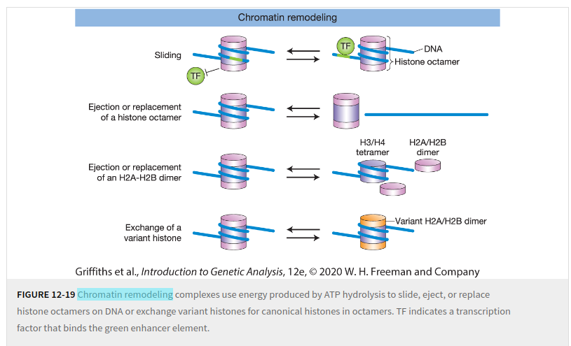
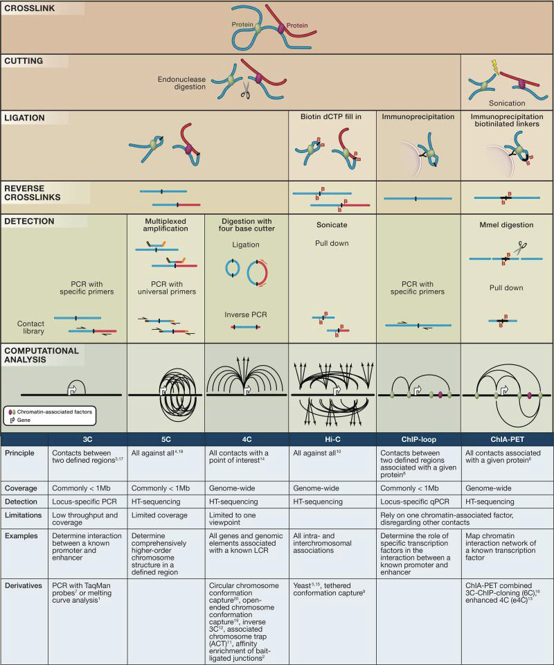

# Applied NGS

## Week 1 Learning Outcomes

- explain RNA processing (e.g. transcription, splicing) and how it motivates specialised tools for data analysis.
- analyse (normalise, transform and visualise) RNA-Seq data.
- compare different RNA-Seq datasets and identify differentially expressed genes in a statistically rigorous way.
- interpret their findings using online databases (in particular individual genes using GeneCards).

## Transcription and mRNA

Exons/introns (eukaryotes), splicing, alternative splicing and isoforms, mRNA, structure of mRNA (not all translated
into proteins)

Source: [Messenger RNA (mRNA): The Link between DNA and Protein](https://www.researchgate.net/publication/301856081_Messenger_RNA_mRNA_The_Link_between_DNA_and_Protein)

In the image:

- **PPP**: *5' Triphosphate Cap* – Protects mRNA from degradation and is important for ribosome recognition during
  translation.
- **uORF**: *Upstream Open Reading Frame* – A small coding region before the main ORF that can regulate translation
  efficiency.
- **ORF**: *Open Reading Frame* – The coding region of mRNA that is translated into protein.
- **3' UTR binding elements**: *3' Untranslated Region Binding Elements* – Sequences in the 3' UTR that regulate mRNA
  stability, localization, and translation.
- **CDS**: *Coding Sequence*  – The portion of mRNA that is translated into a protein, starting with a start codon and
  ending with a stop codon (not in the picture).

You can find the known isoforms of a gene on Ensembl, e.g.
see [here](https://www.ensembl.org/Homo_sapiens/Gene/Summary?db=core;g=ENSG00000167460;r=19:16067021-16103002).

Reference for RNA-seq, [RNA Sequencing and Analysis](https://cshprotocols.cshlp.org/content/2015/11/pdb.top084970.long).

### What are the advantages of RNA sequencing technology over older technologies?

- RNA sequencing (RNA-seq) provides **high resolution**, detecting even rare transcripts and **novel transcripts** not
  present in predefined gene sets (unlike microarrays).
- It allows for **quantitative measurement** of gene expression across the entire transcriptome and offers **better
  dynamic range** for low- and high-abundance transcripts.
- RNA-seq also detects **alternative splicing, fusion genes, post-transcriptional modifications**, and **non-coding RNA
  ** species.

### What are the different types of library preparation and for which use case are they employed?

- **Poly(A) selection**: Enriches mRNA by selecting polyadenylated transcripts, typically used for studying coding RNA
  in eukaryotes; optimal for mRNA.
- **Ribosomal RNA (rRNA) depletion (aka ribodepletion)**: Removes abundant rRNA, useful for detecting both coding and
  non-coding RNA in prokaryotic and eukaryotic samples, and not yet completely spliced transcripts.
- **Strand-specific libraries**: Preserves the directionality of RNA transcripts, helping in the study of overlapping
  genes and antisense transcripts.
- **Total RNA sequencing**: Captures all RNA, including non-coding, to study the whole transcriptome.

### Is the quality of the isolated RNA important?

High-quality RNA is crucial for reliable sequencing data, as degraded or low-quality RNA can lead to biased or
incomplete results, reducing the accuracy of transcript detection and quantification.

Missing quizzes here
https://canvas.bham.ac.uk/courses/74996/pages/check-your-understanding-measuring-rna-levels-by-sequencing?module_item_id=3696338

## Basic Steps in RNA-seq

- **Quality control** after receiving the reads, e.g. with FastQC; note that with RNA-seq you might have biased k-mer
  content. Check if trimming is required, also if there is an excess of polyA tails.
- **Sequence trimming** reads with low quality at the ends can be trimmed, as well as adaptor sequences and polyA tails
  should be removed.
- **Alignment** the reads can be aligned against a reference genome or a genome assembled de-novo. In case of isoforms (
  most but not all the eukaryotes) a splice-aware alignment can be used against a reference, or alignment can be done
  against all the known transcripts.
- **QC after alignment** check the coverage of intergenic, intronic and exonic regions, and ribosomal RNA (ribosomal
  genes). Note that intergenic regions can produce non-coding RNAs (ncRNA). Check the mapping rate (percentage of
  aligned reads) and the uniquely mapped reads.
- **Normalization** to contrast batch effects
- **Quantification**

## What are examples of splice-aware aligners?

- STAR
- Hisat2
- TopHat2
- BBMap
- GMAP/GSNAP

## What are examples of classification based aligners?

- kallisto
- salmon

### Why are genes with low read counts filtered out?

For several reasons:

- **Improved P-value Corrections**: p-value corrections for multiple testing depend on the overall number of tests; with
  fewer genes there are fewer tests, and therefore a smaller correction on p-values, and consequently more power (fewer
  false negatives).
- **Statistical Noise**: Genes with very low counts are more susceptible to random fluctuations and technical noise,
  making it harder to accurately estimate their expression levels.
- **Low Power for Differential Expression Detection**: For genes with low counts, there is often insufficient data to
  detect significant changes in expression between conditions. Filtering these genes improves the overall power of the
  analysis.
- **Computational Efficiency**: Filtering reduces the number of tests that need to be performed, improving computational
  speed and memory usage.

## Units for Normalized Expression Levels

### RPKM

Reads Per Kilobase of transcript per Million mapped reads. Used for single-end reads, it normalises for sequencing depth
and feature length. Meant to compare features within a given sample.

For a given feature:

$$RPKM= 10^9\frac{\mbox{No. of reads mapped to feature}}{\mbox{Feature length} \cdot \mbox{Total no. of mapped reads}}$$

$$= \frac{\mbox{No. of reads mapped to feature}}{\mbox{Feature length in kb} \cdot \frac{\mbox{Total no. of mapped reads}}{10^6}}$$

### FPKM

Fragments Per Kilobase of transcript per Million mapped reads. Same as RPKM, but with fragments (paired-end reads)
instead of reads, it normalises for sequencing depth and feature length. Meant to compare features within a given
sample.

For a given feature:

$$FPKM= 10^9\frac{\mbox{No. of fragments mapped to feature}}{\mbox{Feature length} \cdot \mbox{Total no. of mapped fragments}}$$

$$= \frac{\mbox{No. of fragments mapped to feature}}{\mbox{Feature length in kb} \cdot \frac{\mbox{Total no. of mapped fragments}}{10^6}}$$

### TPM

Transcripts Per Million. Meant to be more comparable across samples than RPKM or FPKM. The sum of TPM values across all
features is the same in each sample.

For a given feature $i$:

$$TPM_i=10^6\frac{\frac{\mbox{No. of reads mapped to feature }i}{\mbox{Feature }i\mbox{ length in kb}}}{\Sigma_j\frac{\mbox{No. of reads mapped to feature }j}{\mbox{Feature }j\mbox{ length in kb}}}$$

Missing quiz
https://canvas.bham.ac.uk/courses/74996/pages/check-your-understanding-the-principles-of-splice-aware-alignment?module_item_id=3696343

### Inter-samples Normalization

Normalization methods that aim at making counts comparable also across samples are:

- **Trimmed Mean of the M-values (TMM)**; it normalizes for sequencing depth and RNA composition, using M-values (
  log-fold changes) and trimming outliers.
- **Quantile normalization**; it makes the overall distribution of expression values identical across samples. It is
  useful when the focus is on directly comparing expression levels, though it may erase important biological differences
  if the assumption of similar distributions is not valid.
- **Voom Transformation (Limma-Voom)**; the voom() function in Limma converts RNA-seq count data into log2 scale while
  estimating mean-variance trends; it assigns precision weights to the counts based on the observed heteroscedasticity,
  making the data more suitable for linear modeling. This effectively adjusts for the variance changes across expression
  levels. It is an effective inter-sample normalisation.

### Why Normalisation?

Normalization is essential to correct for external (non-biological) factors, such as **batch effects**, that can
influence gene expression during sample preparation or sequencing. Without it, samples processed in different batches
may show varying expression levels. The goal of normalization is to ensure all samples have comparable expression
distributions across the experiment.

Normalization can also be necessary to fix/reduce **heteroscedasticity** in count data.

### Why is Heteroscedasticity in Count Data a Problem?

In the context of RNA-seq count data, heteroscedasticity means that the variance in gene expression counts differs
depending on the average expression level. This issue is common in count-based data, like RNA-seq, where genes with
higher expression levels often show more variability than genes with lower expression levels.

- **Why it's a problem**:
    - Heteroscedasticity violates assumptions of many statistical models, leading to unreliable p-values, fold changes,
      and inflated errors.
    - It can lead to imprecise or misleading results in differential expression analyses.

- **How to handle it**:
    - Use statistical models like **negative binomial** (e.g., DESeq2, EdgeR) that account for variance differences.
    - Apply **data transformations** like `voom` or **variance stabilizing transformations** to stabilize the variance
      before analysis.

### What are Design Matrix and Contrast Matrix?

- **Model Matrix (Design Matrix)**: The first step in RNA-seq analysis with tools like limma or edgeR is to create a *
  *design matrix**, which encodes the experimental conditions or factors (e.g., control vs. treatment). The design
  matrix describes how each sample is related to the conditions.

- **Contrast Matrix**: Once the design matrix is set up, the contrast matrix is used to specify the **comparisons of
  interest**. For example, if you want to compare "treatment vs. control," or "treatment1 vs. treatment2," the contrast
  matrix defines the mathematical difference between the conditions.

### What is a PCA Plot of Genex Expression Good For?

The PCA plot can show a separation between sample types (e.g. control and condition), indicating different transcriptional ‘programmes’ being active. A differential gene expression analysis should therefore uncover differentially expressed genes. However, a ‘bad’ PCA plot wouldn’t tell that there is no differential expression, it might just not be captured by the PCA which can only evaluate orthogonal variance, or the discrimination is between other principal components, not the plotted component.

## Pathways

In a living organism, a **pathway** refers to a series of interconnected biochemical reactions or processes that take place within cells to achieve a specific outcome.

### Key Types of Pathways:
1. **Metabolic Pathways**: 
   - These involve the chemical reactions that cells use to convert nutrients into energy and building blocks for growth. 
   - Example: The **glycolysis** pathway, where glucose is broken down to produce energy (ATP).

2. **Signaling Pathways**: 
   - These control how cells communicate and respond to their environment, often through the activation of proteins or other molecules in a sequence.
   - Example: The **MAPK signaling pathway**, which helps regulate cell division, differentiation, and stress responses.

3. **Genetic Pathways**: 
   - These involve the regulation of gene expression, determining when and how genes are activated to produce proteins.
   - Example: The **lac operon** pathway in bacteria, which regulates the expression of genes involved in lactose metabolism.

## Gene Ontology (GO)

An **ontology** is a controlled vocabulary of terms or concepts and a restricted
set of relationships between those terms. The **gene ontoloy (GO)** provides a controlled vocabulary that organizes and unifies the representation of **gene products** across species.

GO is a graph.
- Vertices are GO terms (aka GO classes).
- Edges are relationships between terms.
- The **is-a** relationship organises three disjoint **DAGs**.

**Three disjoint hierarchies** of terms in GO, based on their gene product, called **aspects**:
- **Molecular function** -molecular-level activities performed by gene products.
- **Cellular component** -where the product exhibits its effect.
- **Biological process** -the larger processes, or ‘biological programs’ accomplished by multiple molecular activities; the purpose of the product.

Image source: https://www.ebi.ac.uk/QuickGO/term/GO:0031985

### GO Terms

Each **GO term** must have:
- name;
- unique ID;
- aspect (which of the three sub-ontologies it belongs to);
- relationships to other terms -at a minimum, *is-a* with another term, unless an aspect root;

Each **GO term** may also have:
- secondary IDs;
- synonyms (other names);
- database cross-references;
- comment;
- subset;
- "obsolete" tag.

### GO Annotations

**Annotations** associate a gene or gene product with corresponding GO terms. 

*Gene or gene product <----- annotation -----> GO term*  

**Annotation** of a gene or gene product must contain at a minimum: 
- gene or gene product **identifier**;
- associated **GO term** and its **aspect**;
- **evidence** code (type of evidence that supports the annotation);
- **citation or reference** to the source supporting the annotation (e.g. scientific pubblication or database);

### Taxon constraints

**Taxon constraints** in GO are restrictions that specify whether a particular GO term can or cannot be applied to organisms from certain taxonomic groups (taxa). These constraints help ensure that GO annotations are biologically accurate by preventing the use of terms that are inappropriate or irrelevant for certain organisms.

Example of taxon constraint: 
* term "nucleus" (GO:0005634)
  - Only_in_taxon: Eukaryota
  - Never_in_taxon: Bacteria, Archaea

## Methods for Enrichment Analysis

Enrichment analysis is used to identify if a given list of genes or proteins (often differentially expressed in a study) is associated with certain biological functions, pathways, or other gene sets more than would be expected by chance. 

Two main types of metthods:
- ranked list of (sampled) genes vs. gene sets;
- differentially expressed genes vs. background genes set.

Here's a breakdown of the main methodologies:

### 1. **Gene Ontology (GO) Enrichment Analysis**
   - **Input data**: A list of genes or proteins, often represented by their names or IDs (e.g., gene symbols, Entrez IDs).
   - **Statistical idea**: GO enrichment calculates whether the overlap between the input gene list and predefined GO terms (groups of genes annotated with common functions) is statistically significant. Common statistical tests used include the Fisher's Exact Test or Hypergeometric Test.
   - **External data**: Gene Ontology, which provides hierarchical sets of biological processes, molecular functions, and cellular components associated with genes.
   - **Pitfalls and biases**:
     - **Bias towards well-studied genes**: Genes that have been extensively studied (e.g., in model organisms like humans and mice) are more likely to be annotated with GO terms, leading to biased results.
     - **Hierarchical structure**: GO terms are organized in a hierarchy, so parent terms may be enriched just because their child terms are, which can complicate interpretation.
     - **Multiple testing problem**: Testing multiple GO terms increases the risk of false positives, necessitating correction methods like Bonferroni or Benjamini-Hochberg.

### 2. **KEGG Pathway Enrichment Analysis**
   - **Input data**: A list of gene or protein identifiers, such as gene symbols or Ensembl IDs.
   - **Statistical idea**: Similar to GO analysis, this method assesses whether the input gene list is significantly enriched in specific biological pathways. Hypergeometric testing or Fisher's Exact Test is commonly used to evaluate over-representation in KEGG pathways.
   - **External data**: The Kyoto Encyclopedia of Genes and Genomes (KEGG), a curated database of pathways involved in metabolic, cellular, and systemic processes.
   - **Pitfalls and biases**:
     - **Pathway completeness bias**: KEGG pathways are manually curated and tend to reflect well-studied biological processes, leading to underrepresentation of less-characterized pathways.
     - **Multiple hypothesis testing**: Testing many pathways leads to increased false positives, requiring multiple testing correction.
     - **Species bias**: KEGG pathway annotations are often incomplete or less accurate for non-model organisms.

### 3. **Gene Set Enrichment Analysis (GSEA)**
   - **Input data**: A ranked list of all genes (based on an expression metric, such as log fold change), rather than a simple list of "significant" genes.
   - **Statistical idea**: GSEA assesses whether predefined gene sets (e.g., from GO or KEGG) are enriched at the top (over-expressed genes) or bottom (under-expressed genes) of the ranked list. It uses a running-sum statistic, comparing it to a null distribution obtained through permutation.
   - **External data**: Predefined gene sets from databases like MSigDB (Molecular Signatures Database), including pathways, GO terms, and curated gene sets.
   - **Pitfalls and biases**:
     - **Gene ranking dependency**: Results can be highly sensitive to how genes are ranked. If ranking is based on an arbitrary or unstable statistic, the results may be less reliable.
     - **Choice of gene set database**: Different databases can give different results, and poorly curated gene sets may introduce bias.
     - **Permutations for null distribution**: For small gene sets or small sample sizes, permutations may lead to unstable estimates of significance.

### 4. **Over-Representation Analysis (ORA)**
   - **Input data**: A list of differentially expressed genes (or proteins), typically identified through statistical tests in an omics study.
   - **Statistical idea**: ORA tests whether genes from a particular gene set (e.g., a pathway or functional category) appear more frequently in the input list than expected by chance. The hypergeometric test or Fisher's Exact Test is often used.
   - **External data**: Predefined gene sets from databases like GO, KEGG, or Reactome.
   - **Pitfalls and biases**:
     - **Input size sensitivity**: The method can be biased by the size of the input gene list. Longer gene lists can artificially inflate enrichment scores.
     - **Well-studied genes bias**: Similar to GO and KEGG, there is bias towards well-annotated genes.
     - **Static cutoffs**: ORA relies on a pre-defined list of "significant" genes, but this ignores genes that are just below the cutoff, leading to a loss of information.

### 5. **Functional Class Scoring (FCS)**
   - **Input data**: Continuous values (e.g., expression data) for all genes rather than a discrete gene list.
   - **Statistical idea**: FCS methods test whether entire gene sets show coordinated changes in expression across samples, rather than focusing only on individual genes. Gene set statistics are aggregated across the gene set, and permutation tests are used to assess significance.
   - **External data**: Gene sets from databases like GO, KEGG, or custom gene sets.
   - **Pitfalls and biases**:
     - **Gene co-expression**: FCS may give high scores to gene sets with correlated gene expression, even if the biological relevance is unclear.
     - **Sample size sensitivity**: Requires careful normalization and sufficient sample sizes to prevent false positives or negatives.
     - **Choice of gene set**: Biased or poorly defined gene sets can result in misleading conclusions.

### 6. **Network-Based Enrichment Analysis**
   - **Input data**: Gene/protein lists, often with associated interaction or expression data.
   - **Statistical idea**: This method incorporates interaction networks (e.g., protein-protein interactions) into enrichment analysis, identifying enriched subnetworks or modules within the larger gene/protein interaction network. Permutation-based statistics are often used to evaluate significance.
   - **External data**: Protein-protein interaction (PPI) networks, pathway databases, and interaction data from sources like STRING or BioGRID.
   - **Pitfalls and biases**:
     - **Network completeness bias**: Interaction networks are incomplete and biased towards well-studied proteins, which can skew results.
     - **Network dynamics**: Static interaction networks might not account for context-specific interactions, which can lead to misleading biological interpretations.
     - **Topological biases**: Highly connected "hub" proteins in the network are more likely to appear enriched, even if biologically irrelevant.

### 7. **Reactome Pathway Analysis**
   - **Input data**: A list of genes or proteins, represented by standard gene or protein identifiers.
   - **Statistical idea**: Similar to KEGG and GO analysis, it tests for over-representation of genes in known biological pathways using hypergeometric or Fisher’s tests.
   - **External data**: The Reactome pathway database, which contains curated pathways for various biological processes.
   - **Pitfalls and biases**:
     - **Species bias**: Like KEGG, Reactome is more complete for model organisms.
     - **Pathway annotation bias**: Pathways that are well studied tend to have more gene annotations, leading to biased enrichment results.

### General Biases Across Methods:
   - **Literature bias**: All of these methods are heavily reliant on curated databases, which are often biased towards well-studied genes and pathways (e.g., human, mouse). This may leave less-studied genes or pathways underrepresented.
   - **Multiple testing correction**: As all methods involve testing many gene sets, pathways, or terms, they are prone to false positives if appropriate corrections for multiple testing (e.g., FDR correction) are not applied.
   - **Thresholding issues**: Methods that rely on fixed thresholds (e.g., ORA, GO) can miss biologically relevant genes that fall just below the significance cutoff.

Each method offers unique strengths and weaknesses, and the choice of method depends on the dataset, the biological question, and the level of bias one is willing to accept.

## Gene Set Enrichment Analysis (GSEA)

**GSEA** is meant to find which *sets of genes* are *enriched* (over-expressed and/or under-expressed) in one biological state compared to another one (e.g. treatment vs. control). It can be used for comparison of samples belonging to two groups (biological state) only, and works best with a large number of samples (as it will allow to permute samples to generate empirical p-values)

Image source: https://pubmed.ncbi.nlm.nih.gov/16199517/

- **Measure** the expression of some genes in two biological classes, taking multiple samples per gene and per class.
- **Rank** the genes based on some metric (e.g. fold-change between control and treatment, adjusted p-value). The metric must express a correlation between the genes and a phenotype or profile of interest.
- Chose a number of **gene sets**.
- For each gene set, calculate the **enrichment score** (ES).
- **Normalize** the ESs to account of the size of the gene sets.
- Generate null distributions generated using permutations (of sampes, prefereably), use them to **estimate empirical p-values or FDRs**.
- Correct the p-values or FDR for **multiple testing**.
- Determine gene sets that are **significantly enriched**.

The *ES* for a given gene set (against the ranked list) is calculated from a running total. 
- The running total starts at 0.
- For every gene in the ranked list, if the gene is also in the given set, then add to the running total; otherwise subtract from it. 
- The amount added is the correlation between samples in the two groups for the given gene. The amount subtracted is constant, and depends on the respective length of the ranked list and the given gene set.
- The ES is the maximum deviation from 0 of the running total.

Note: **direction of the comparison** between the two biological classes may matter, e.g. when comparing expression of genes on the sex chromosomes between males and females.

Genes in the ranked list that come before the one with the highest running total are the **leading edge**.

Collections of useful gene sets are provided, e.g. see **MSigDB**.

## **Chromatin Modification Vs. Remodeling**

With **chromatin modification (aka epigenetic modifications)**, enzymes alter the chemical structure of amino acids in histones or nucleotides in DNA to affect recruitment of transcription factors, coregulators, and general transcription factors to chromatin. They **affect transcription**, but **don't alter the sequence of DNA bases**. They can be modifications to the DNA or histones, and include
- **DNA Methylation**: Gene silencing, heterochromatin formation.
- **Histone Acetylation**: Gene activation, open chromatin (euchromatin).
- **Histone Methylation**: Can either activate or repress genes (context-dependent).
- **Histone Phosphorylation**: Regulation of DNA repair, mitosis, and apoptosis.
- **Histone Ubiquitination**: Gene activation or repression, depending on histone type.
- **Histone Sumoylation**: Gene repression.

**Chromatin remodeling** alters chromatin structure to regulate transcription.
It changes histone-DNA interactions in nucleosomes to render DNA either more or less accessible to transcription regulators. It can move histones to new locations, it can eject or incorporate them in chromatine, and replace them with their variants. 

, the accessibility of DNA to transcription factors, coregulators, and general transcription factors is altered by enzymes that use energy from ATP hydrolysis to remodel nucleosomes; that is, reposition histone octamers along the DNA, remove histone octamers from DNA, or replace canonical histones in octamers with variant histones.

## Chromatine Remodeling and Protein-DNA Interaction

### 1. **What type of proteins interact with DNA?**
   DNA-interacting proteins play crucial roles in regulating gene expression, replication, and DNA repair. The main types include:

   - **Transcription Factors**: Bind to specific DNA sequences to regulate transcription.
   - **Histones**: Proteins around which DNA winds to form chromatin.
   - **DNA Polymerases**: Enzymes that replicate DNA.
   - **Helicases**: Unwind the DNA helix during replication and transcription.
   - **Topoisomerases**: Relieve supercoiling during replication and transcription.
   - **Chromatin Remodelers**: Alter the structure of chromatin to regulate access to DNA.
   - **Cohesins/Condensins**: Facilitate the organization and separation of chromosomes during cell division.
   - **DNA Repair Proteins**: Recognize and repair damaged DNA.

### 2. **What are Transcription Factors (TFs)?**
   **Transcription factors (TFs)** are proteins that regulate gene expression by binding to specific DNA sequences near target genes (typically at promoters, enhancers, or silencers). They control the recruitment of RNA polymerase and other transcriptional machinery to initiate or inhibit transcription.

   - **Mechanism of Action**:
     1. **DNA Binding**: TFs have DNA-binding domains that allow them to recognize and bind specific sequences (motifs) in the DNA.
     2. **Recruitment of Coactivators or Corepressors**: Once bound to DNA, they recruit other proteins like coactivators (to enhance transcription) or corepressors (to inhibit transcription) to activation/repression domains.
     3. **Regulation of Chromatin Structure**: Some TFs can recruit chromatin remodelers to modify histones or alter nucleosome positioning, making DNA more or less accessible to the transcriptional machinery.
     4. **Response to Signals**: Many TFs are activated by external signals (e.g., hormones, growth factors) and move from the cytoplasm to the nucleus to exert their effects.

### 3. **What are histone proteins and how do they interact with DNA to form chromatin**
   Histones are the primary protein components of chromatin, which is a complex of DNA and protein. DNA wraps around histone proteins to compact the DNA into a more organized structure.

   - **Nucleosome Formation**: Histones are organized into octamers (two copies each of H2A, H2B, H3, and H4) around which approximately 146 base pairs of DNA are wound. This structure is called a **nucleosome**.
   - **Linker Histone (H1)**: Another histone, H1, binds to the DNA between nucleosomes (linker DNA) and helps compact nucleosomes into a higher-order structure.
   - **Histone-DNA Interactions**: Histones have positively charged amino acids (e.g., lysine and arginine) that interact with the negatively charged phosphate backbone of DNA. This interaction helps stabilize the chromatin structure.
   - **Chromatin Compaction**: Nucleosomes are further compacted into higher-order structures, eventually forming chromatin fibers that help condense DNA into chromosomes during cell division.

### 4. **What are the differences between euchromatin and heterochromatin**
   - **Euchromatin**: 
     - **Structure**: Loosely packed chromatin.
     - **Histone Modifications**: Associated with active histone modifications, like acetylation (H3K9ac) and certain methylation marks (H3K4me3), which open chromatin.
     - **DNA Accessibility**: DNA is more accessible to transcription factors and RNA polymerase.
     - **Gene Expression**: Genes are actively transcribed.

   - **Heterochromatin**:
     - **Structure**: Densely packed chromatin.
     - **Histone Modifications**: Enriched in repressive histone marks, such as methylation at H3K9 (H3K9me3) or H3K27 (H3K27me3), which result in tighter chromatin compaction.
     - **DNA Accessibility**: DNA is less accessible due to the tightly packed nature of the chromatin.
     - **Gene Expression**: Genes in heterochromatic regions are generally silenced or inactive.

## Epigenomic Profiling

### 1. **Using Restriction Enzymes**
   - **Method**: This approach involves cutting DNA at specific recognition sites using restriction enzymes that are sensitive to DNA methylation. Methylated and unmethylated DNA fragments are then differentially analyzed.
   - **Purpose**: To assess **DNA methylation patterns** by comparing methylation-sensitive and insensitive enzyme cuts.
   - **Array or Sequencing**: This can be both **array-based** (e.g., HELP assay) and **sequencing-based** (e.g., Methylation-Sensitive Restriction Enzyme Sequencing, MSRE-seq).
   - **Acronym**: MSRE (Methylation-Sensitive Restriction Enzymes).

### 2. **Using Affinity Enrichment**
   - **Method**: This involves enriching DNA fragments with specific epigenetic marks (e.g., methylation or histone modifications) using antibodies (immunoprecipitation) or methyl-binding proteins.
   - **Purpose**: To profile regions of DNA that are modified by specific epigenetic markers, such as **5-methylcytosine** or **histone modifications**.
   - **Array or Sequencing**: It is primarily **sequencing-based** (e.g., Methylated DNA Immunoprecipitation Sequencing, MeDIP-seq) but can also use **arrays** (e.g., MeDIP-chip).
   - **Acronym**: MeDIP (Methylated DNA Immunoprecipitation), ChIP-seq (Chromatin Immunoprecipitation sequencing).

### 3. **Using Bisulfite Conversion**
   - **Method**: DNA is treated with bisulfite, which converts unmethylated cytosines to uracils, while leaving methylated cytosines unchanged. The treated DNA is then sequenced to determine methylation status.
   - **Purpose**: To map **DNA methylation at single-base resolution**.
   - **Array or Sequencing**: Both **array-based** (e.g., Illumina Infinium MethylationEPIC Array) and **sequencing-based** (e.g., Whole-Genome Bisulfite Sequencing, WGBS).
   - **Acronym**: WGBS (Whole-Genome Bisulfite Sequencing), BS-seq (Bisulfite Sequencing).

### 4. **Using Open-Chromatin Digestion**
   - **Method**: This technique identifies open and accessible regions of chromatin, typically using DNase I or Tn5 transposase, which preferentially digests or tags open chromatin regions.
   - **Purpose**: To profile **regions of open chromatin**, indicating active regulatory regions such as promoters and enhancers.
   - **Array or Sequencing**: Primarily **sequencing-based** (e.g., ATAC-seq for Assay for Transposase-Accessible Chromatin, DNase-seq).
   - **Acronym**: -eq (Assay for Transposase-Accessible Chromatin), DNase-seq.

Each method serves a different purpose in uncovering various aspects of the epigenome, such as DNA methylation, histone modifications, or chromatin accessibility.

## Q&A

### 1. **What are the methods to detect DNA methylation?**
   - **Bisulfite Sequencing** (BS-seq/WGBS): Converts unmethylated cytosines to uracils for sequencing to identify methylation at single-base resolution.
   - **Methylated DNA Immunoprecipitation** (MeDIP-seq): Uses antibodies to enrich for methylated DNA followed by sequencing.
   - **Methylation-Sensitive Restriction Enzyme Sequencing** (MSRE-seq): Uses methylation-sensitive restriction enzymes to cut and sequence unmethylated regions.
   - **Illumina Infinium Methylation Array**: An array-based method for profiling methylation at specific CpG sites.

### 2. **Which ‘omics methods can measure chromatin accessibility?**
   - **ATAC-seq** (Assay for Transposase-Accessible Chromatin sequencing): Uses Tn5 transposase to tag open chromatin regions.
   - **DNase-seq**: Utilizes DNase I to digest accessible chromatin followed by sequencing.
   - **FAIRE-seq** (Formaldehyde-Assisted Isolation of Regulatory Elements): Isolates open chromatin regions based on DNA-protein crosslinking.

### 3. **Which ‘omics method can measure regions of transcription factor binding or histone modifications?**
   - **ChIP-seq** (Chromatin Immunoprecipitation sequencing): Uses antibodies to target specific histone modifications or transcription factor-bound DNA, followed by sequencing to map these regions.
   - **CUT&RUN** (Cleavage Under Targets and Release Using Nuclease): Targets histone modifications or transcription factors with antibodies, followed by DNA cleavage and sequencing for mapping.

## Steps to Chip-seq

Chromatin Immunoprecipitation followed by sequencing (ChIP-seq) is a method used to analyze protein-DNA interactions. Here’s a brief overview of the key steps involved:

1. **Cross-linking**: Cells or tissues are treated with formaldehyde to cross-link proteins to DNA, preserving their interactions.

2. **Chromatin Fragmentation**: The cross-linked chromatin is sheared into small fragments, either by sonication or enzymatic digestion.

3. **Immunoprecipitation (IP)**: An antibody specific to the protein of interest (e.g., a transcription factor or histone modification) is used to immunoprecipitate the protein-DNA complexes.

4. **Reverse Cross-linking**: The cross-links between proteins and DNA are reversed to free the DNA from the proteins.

5. **DNA Purification**: The DNA is purified to remove proteins and other contaminants.

6. **Sequencing**: The purified DNA is prepared for high-throughput sequencing, typically using next-generation sequencing (NGS) platforms.

7. **Quality Control of Raw Reads**:
   - Use tools like **FastQC** to assess the quality of the raw sequencing reads.
   - Check for issues such as low-quality bases, adapter contamination, or overrepresented sequences.

8. **Read Preprocessing**:
   - **Trimming**: Remove adapter sequences and low-quality bases using tools like **Trim Galore!** or **Cutadapt**.
   - **Filtering**: Discard reads that are too short or of poor quality to improve downstream analyses.

9. **Alignment to Reference Genome**:
   - Map the cleaned reads to a reference genome (e.g., human genome GRCh38) using aligners like **Bowtie2** or **BWA**.
   - Generate alignment files in SAM/BAM format.

10. **Post-alignment Processing**:
    - **Sorting and Indexing**: Use tools like **SAMtools** to sort and index BAM files.
    - **Duplicate Removal**: Eliminate PCR duplicates using **Picard MarkDuplicates** or **SAMtools rmdup** to reduce bias.
    - **Filtering**: Remove improperly paired reads or those with low mapping quality.
    - **Blacklisting**: Some regions are difficult to call, and a blacklist is useful to ‘hide’ them: One possible list to use is the ENCODE blacklist.

11. **Peak Calling**:
    - Identify regions of significant enrichment (peaks) using peak-calling algorithms like **MACS2**.
    - Compare ChIP samples to control inputs (e.g., input DNA or IgG controls) to distinguish true binding sites from background noise.

12. **Peak Annotation**:
    - Associate peaks with genomic features (genes, promoters, enhancers) using tools like **HOMER**, **ChIPseeker**, or **annotatePeaks.pl**.
    - Determine the distribution of peaks across genomic regions.

13. **Visualization**:
    - Create coverage tracks (e.g., BEDGraph or BigWig files) for visualization in genome browsers like **IGV** or **UCSC Genome Browser**.
    - Visualize peak regions and alignments to assess data quality and peak localization.

14. **Motif Analysis**:
    - Perform de novo motif discovery to identify DNA sequences enriched within the peaks using tools like **MEME** or **HOMER**.
    - Compare discovered motifs with known databases to identify potential transcription factor binding sites.

15. **Differential Binding Analysis** (if comparing conditions):
    - Use tools like **DiffBind** or **csaw** to identify peaks that are differentially bound between experimental conditions or treatments.

16. **Functional Enrichment Analysis**:
    - Conduct Gene Ontology (GO) and pathway enrichment analyses on genes associated with peaks using tools like **DAVID**, **Gene Ontology Consortium**, or **Enrichr**.
    - Identify biological processes, molecular functions, or pathways that are significantly enriched.

17. **Cross-referencing**:
    - integrating ChIP-seq peak lists and cross-referencing with expression data, gene promoters, or known SNPs (Intersect or join box).

18. **Validation and Reporting**:
    - Validate findings using independent methods if possible (e.g., qPCR).
    - Document all analysis steps, parameters, and results in a comprehensive report.

## Chromosme Conformation Capture

**Chromosome conformation capture** techniques are a set of molecular biology methods used to analyze the spatial organization of chromatin in a cell.

Image source: https://www.ncbi.nlm.nih.gov/pmc/articles/PMC6374129/

### Levels of Chromatin 3D Organization

Chromatin within the nucleus is organized in multiple hierarchical levels, with distinct structures guiding gene regulation and DNA accessibility:

1. **Nucleosomes**: The fundamental unit of chromatin, where ~147 bp of DNA is wrapped around histone proteins. These are the most basic level of chromatin structure.
   
2. **Chromatin Loops**: At a larger scale, DNA forms loops, bringing distant parts of the genome into close proximity. These loops allow interactions between enhancers and promoters or between other regulatory elements, influencing gene expression.

3. **Topologically Associating Domains (TADs)**: TADs are contiguous regions within the genome where chromatin interacts more frequently within the domain than with regions outside. TAD boundaries tend to be stable and are thought to insulate regulatory interactions.

4. **Compartmental Domains**: Chromatin is divided into compartments, typically referred to as **A** and **B** compartments. **A compartments** are generally active, gene-rich, and accessible regions, while **B compartments** are inactive, gene-poor, and repressed regions. Compartmentalization reflects a higher-order organization of TADs.

### Roles of the Cohesin Protein Complex and CTCF in Chromatin Loop Formation

1. **Cohesin**: Cohesin is a ring-shaped protein complex that holds sister chromatids together during cell division but also plays a crucial role in facilitating chromatin loops in interphase. Cohesin loads onto chromatin and extrudes loops by bringing distant regions of DNA into proximity, a process often regulated by boundary elements like CTCF.

2. **CTCF (CCCTC-binding factor)**: CTCF is a DNA-binding protein that serves as a boundary element for chromatin loops. It typically binds to specific sites on DNA (often forming the boundaries of TADs) and works in concert with cohesin to anchor the ends of loops. CTCF binding sites are enriched at the edges of chromatin loops and often regulate gene expression by insulating enhancers and promoters within TADs.

### Topologically Associating Domains (TADs)

TADs are genomic regions within which chromatin has a high frequency of interactions. They act as regulatory units, ensuring that enhancers or other regulatory elements interact with genes within the same domain. TADs are bordered by insulator elements such as CTCF binding sites, which prevent cross-domain interactions. The disruption of TAD boundaries can lead to inappropriate gene regulation and has been implicated in diseases like cancer.

### Connection Between Chromatin Compartments, Chromatin Accessibility, and Transcriptional Activity

- **Chromatin compartments (A/B)** reflect the large-scale functional organization of the genome:
  - **A compartments** are gene-rich, transcriptionally active, and associated with euchromatin, which is more open and accessible to transcription factors.
  - **B compartments** are gene-poor, transcriptionally inactive, and associated with heterochromatin, which is more condensed and less accessible.

- **Chromatin accessibility** is crucial for transcription. Open chromatin regions, often found in **A compartments**, allow transcription factors and the transcriptional machinery to access regulatory elements such as promoters and enhancers.

- Transcriptional activity is usually higher in regions of open chromatin and **A compartments**, where genes are accessible. In contrast, regions of **B compartments** tend to be transcriptionally silent, with compact chromatin that is less accessible.

### ‘Omics Methods to Measure Chromatin Contacts

Several methods have been developed to study chromatin contacts at various resolutions, from individual loci interactions to genome-wide interactions:

1. **Chromosome Conformation Capture (3C)**: A targeted method to study interactions between specific loci. It uses cross-linking to preserve DNA contacts, followed by restriction digestion, ligation, and PCR to detect the interactions between two loci.

2. **4C (Circular Chromosome Conformation Capture)**: Allows the identification of all interactions of a specific locus with the rest of the genome by using inverse PCR after the 3C protocol.

3. **5C (Carbon Copy Chromosome Conformation Capture)**: A multiplexed version of 3C that can examine many interactions across a genomic region. It is suited for studying interactions across a small genomic region but with higher throughput.

4. **Hi-C**: A genome-wide approach that captures all chromatin interactions within a genome. Hi-C generates contact maps that show interaction frequencies between all pairs of loci in the genome. This method is widely used for studying TADs, loops, and compartments.

5. **ChIA-PET (Chromatin Interaction Analysis by Paired-End Tag sequencing)**: A method to study chromatin contacts that are mediated by a specific protein, like CTCF. It combines chromatin immunoprecipitation (ChIP) with chromatin interaction mapping to identify protein-mediated loops.

### Method to Test if a Chromatin Contact Exists Between 2 Loci

To test if a specific chromatin contact exists between two loci, **3C** (Chromosome Conformation Capture) is the most suitable method. It provides direct evidence of physical interaction between two selected regions of the genome by cross-linking, ligating, and using PCR with primers specific to the two loci of interest.

### Method to Identify All Other Loci That Interact with a Specific Locus

To identify all loci that interact with a specific locus, **4C** (Circular Chromosome Conformation Capture) would be the method of choice. 4C allows for the comprehensive mapping of all regions of the genome that physically interact with a given locus, providing a more holistic view of its interaction network.

